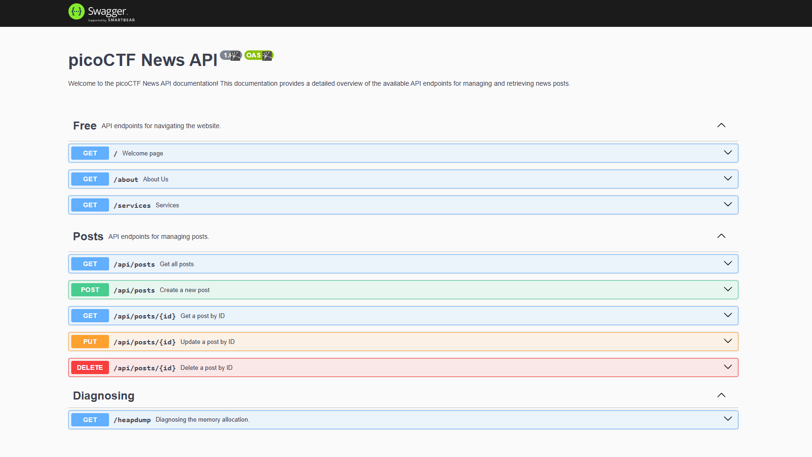

# 🧪 head-dump

## 🔍 Observations

- Navigated through the site, taking note of all available pages and subpages.
- Found a link that led to exposed Swagger documentation.  
  
- While exploring the Swagger API endpoints, one in particular stood out: `/heapdump`.

---

## 🧠 Thought Process

- Initially focused on passive reconnaissance — familiarizing myself with the app structure.
- The exposed Swagger docs seemed like a goldmine, revealing backend API endpoints that might not be directly accessible from the UI.
- `/heapdump` looked interesting — typically used for memory diagnostics, which can unintentionally leak sensitive data if not properly secured.

---

## 🧨 Exploitation

- Accessed the `/heapdump` endpoint and downloaded the resulting file.
- Since heap dumps often contain raw memory data, I opened it in a text editor and searched for the flag format.
- Used `CTRL+F` to search for the flag prefix: `picoCTF{`
- Boom — the flag was sitting in plain text.

### 🔧 Payloads Used:

- Direct GET request to:
  ```
  /heapdump
  ```
- Searched the downloaded file for:
  ```
  picoCTF{
  ```

---

## 📝 What I Learned

- Heap dumps can leak a **lot** of sensitive information if not handled securely.
- Exposing debug or diagnostic endpoints like Swagger and `/heapdump` on a production-facing service is a huge security risk.
- Always sanitize and restrict access to debugging tools and memory dumps.
- Never underestimate `CTRL+F`.
